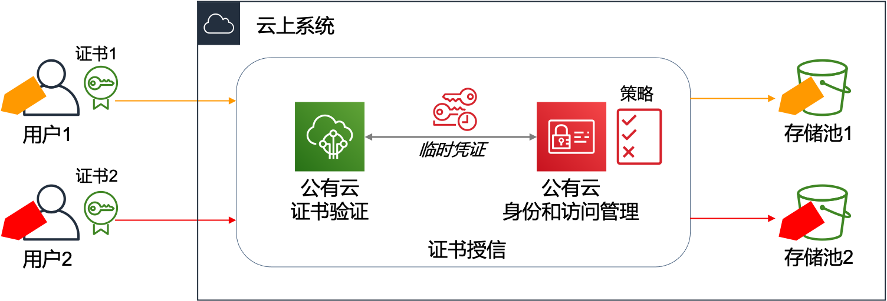
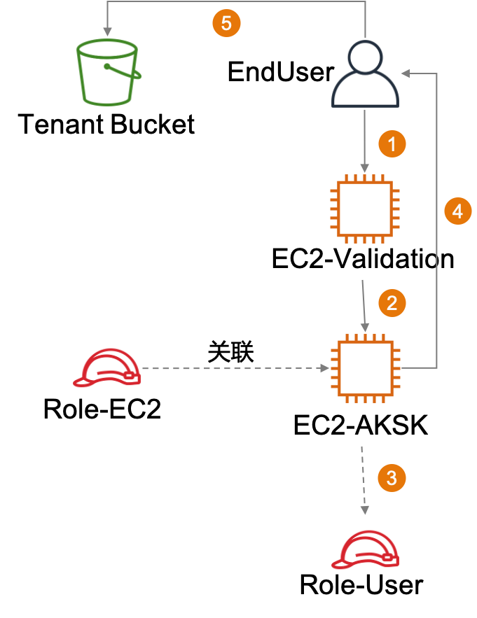

# AWS-Authorization-Methods
 
中文 ｜ [English](README-ENG.md)

在 AWS 上部署的 SaaS 应用，有时需要授权应用的最终用户直接访问 AWS 资源。例如：允许最终用户将视频、照片的多媒体文件上传至属于自己的 S3 目录中。

最为简单的操作是为每个最终用户创建一个 IAM User，分别关联不同的 IAM Policy，通过 IAM Policy 限定不同的 IAM User 只能访问特定的 S3 存储桶（或存储桶中的目录）。每一个最终用户都通过各自的 IAM User 获得访问 AWS 资源的授权。

然而这种方式将 IAM User 和 SaaS 应用的最终用户进行 1:1 的关联，静态生成授权凭证，安全上存在较大风险。此外，IAM 在同一账户内仅支持创建 200 个 IAM User，方案的扩展性也非常有限。

本方案介绍两种不同的授权方式，以满足在 SaaS 模式下，安全的向海量用户进行授权的工作方式。

>本方案中所指的“访问权限”是指针对于公有云资源的访问权限，而不是用户访问应用模块的权限。

## [通过 IoT 证书实现授权](iot-cert/iot-cert-cn.md) ##

可以向每个最终用户发放签名后的证书，最终用户通过证书完成认证、授权工作。方案逻辑架构如下：

- 每个用户拥有公有云签发的证书；
- 用户利用自己的证书向公有云请求存储访问权限；
- 公有云身份和访问管理系统依据策略，向登录后的用户提供临时凭证；
- 用户使用临时凭证向自己的存储池写入数据。

这将借助公有云 IoT 的服务能力，完成对用户的身份验证（证书校验）和访问授权（获取资源访问权限）。方案特点如下：

- 最终用户通过证书获取临时的资源访问凭证；
- 可以为所有用户准备相同的权限策略，通过策略中的变量实现对不同用户授予不同的访问权限；
- 需要将签发用户证书时使用的 CA 证书导入到公有云，或直接使用公有云签发的证书。

通过 [这里](iot-cert/cert-Auth-cn.md) 了解方案的详细介绍。

## [通过用户属性获得临时授权](ass-role/ass-role-cn.md) ##
本方式将用户的身份验证和访问授权分开。应用平台完成对用户的身份验证后，通过调用公有云服务获得临时访问凭证。在调用过程中可通过代码生成临时的权限策略，实现对不同用户授予不同的访问权限。方案逻辑架构如下：

1. 最终用户向应用平台发起登录；
2. 登录、校验 token 成功，将 user info 传递给 CredentialsManager；
3. 根据 user info 生成临时 AKSK，代码中自定义 session policy, session name, duration等参数
4. 向最终用户返回临时 AKSK；
5. 最终用户通过 客户端，使用临时 AKSK 访问 S3 中的对应目录。

这里将用户的认证和授权分开，认证功能仍然保留原有的应用逻辑，而授权部分则需要增加调用公有云服务的代码。方案特点如下：

- 使用应用程序原有的身份验证功能，无需引入多到身份验证系统，并在其中进行身份的关联映射；
- 可以根据不同用户的属性动态生成权限，权限更加灵活；
- 需要对应用中原有的认证、授权体系进行改造，与云平台做紧密集成。

通过 [这里](ass-role/ass-role-cn.md) 了解方案的详细介绍。