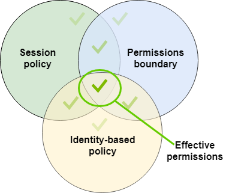

## Authorization-based-on-Session-Policy
以 AWS 为例，如果希望获得公有云资源的访问权限，必须通过 IAM 服务。最终用户通过使用一个 IAM 实体（IAM 用户或 IAM 角色），获得相关权限。在这个 IAM 实体上关联着一个或多个 IAM 策略，最终用户所获得的权限就是 IAM 策略中所声明的权限。

本方案中，应用平台的认证模块将完成对最终用户的身份认证。随后通过调用 AssumeRole API 获得访问 AWS 资源的临时凭证。这个临时凭证上附带着根据不同用户属性所生成的 IAM 策略。

###关于-IAM-策略
IAM 中包含以下策略类型可在 AWS 中使用：

- **基于身份的策略（Identity-based policies）** – 将托管策略和内联策略附加到 IAM 身份（用户、用户所属组或角色）。基于身份的策略向身份授予权限。

- **基于资源的策略（Resource-based policies ）** – 将内联策略附加到资源。基于资源的策略的最常见示例是 Amazon S3 存储桶策略和 IAM 角色信任策略。基于资源的策略向在策略中指定的委托人授予权限。委托人可以与资源位于同一个账户中，也可以位于其他账户中。

- **权限边界（Permissions boundaries）** – 使用托管策略作为 IAM 实体（用户或角色）的权限边界。该策略定义基于身份的策略可以授予实体的最大权限，但不授予权限。权限边界不定义基于资源的策略可以授予实体的最大权限。

- **组织 SCP（Organizations service control policy）** – 使用 AWS Organizations 服务控制策略 (SCP) 为组织或组织单元 (OU) 的账户成员定义最大权限。SCP 限制基于身份的策略或基于资源的策略授予账户中实体（用户或角色）的权限，但不授予权限。

- **访问控制列表 (ACL)** – 使用 ACL 来控制其他账户中的哪些委托人可以访问 ACL 附加到的资源。ACL 类似于基于资源的策略，但它们是唯一不使用 JSON 策略文档结构的策略类型。ACL 是跨账户的权限策略，向指定的委托人授予权限。ACL 不能向同一账户内的实体授予权限。

- **会话策略（Session policies）** – 在使用 AWS CLI 或 AWS API 担任某个角色或联合身份用户时，传递高级会话策略。会话策略限制角色或用户的基于身份的策略授予会话的权限。会话策略限制所创建会话的权限，但不授予权限。有关更多信息，请参阅会话策略。

在本方案中使用的策略类型为 **会话策略（Session policies）**。会话策略是当您以编程方式为角色或联合身份用户创建临时会话时作为参数传递的高级策略。会话的权限是用于创建会话的 IAM 实体（用户或角色）的基于身份的策略与会话策略的交集。权限也可以来自基于资源的策略。任一项策略中的显式拒绝将覆盖允许。

可以使用 AssumeRole、AssumeRoleWithSAML 或 AssumeRoleWithWebIdentity API 操作以编程方式创建角色会话和传递会话策略。可以使用 Policy 参数传递单个 JSON 内联会话策略文档。也可以使用 PolicyArns 参数指定最多 10 个托管会话策略。
        
在这种情况下，生成的会话的权限是会话策略、权限边界和基于身份的策略的交集。



###实现原型
从整体功能划分的角度来说，整个方案的实现需要 3 部分功能模块。

- 身份验证模块：用于验证用户身份的合法性，并传递相关参数给凭证管理模块；
- 凭证管理模块：通过调用 AssumeRole API，获得可以访问 AWS 资源的临时凭证；
- 应用模块：利用凭证管理模块中生成的临时凭证访问 AWS 资源，满足应用逻辑的需求。

**0. 预条件设置**

方案中包括的各个代码模块可以在同一台服务器上执行，也可以部署在不同服务器上。其中 *凭证管理模块* 所在的服务器必须具备执行 AssumeRole 的权限。以 EC2 为例进行说明。

在 *凭证管理模块* 所在的 EC2 上需要关联一个角色（假设名称为：ec2-role），该角色的 Trusted Identity 为 ec2 服务。允许的策略如下：

```json
{
    "Version": "2012-10-17",
    "Statement": [
        {
            "Sid": "VisualEditor0",
            "Effect": "Allow",
            "Action": "sts:*",
            "Resource": "*"
        }
    ]
}
```

如希望进一步缩小权限，可以在 Resource 字段中指明被继承角色的 ARN。

此外需要准备另外一个角色，这是 *凭证管理模块* 所继承的实际角色（假设名称为 ass-role），该角色的 Trusted Identity 为 ec2-role。即：该角色仅可以被 ec2-role 所继承，其它 IAM 实体不能使用 ass-role。

该角色上附加的权限根据实际需求进行设定。它实际上是最终用户可以获得的最大权限边界。

**1. 身份验证模块**

不同公司、不同系统所使用的身份验证逻辑不同，具体的实现方式并不影响本方案的效果，因此无需对验证模块的主体框架进行修改。

但在验证结束后，需要将用户的相关属性传递给授权模块（例如租户 ID、用户 ID）。

不同的用户可能需要附加不同的会话策略，无论是分配预先映射好的策略还是通过代码临时生成策略，都需要传递给凭证管理模块作为必要的参数。

此部分实现可参考 [身份验证模块示例代码](sample-auth.cs)。

**2. 凭证管理模块**

该模块通过调用 AssumeRole API 以获取临时凭证。在调用过程中需要传递的几个关键参数包括：

- RoleArn：要继承的 IAM 角色（即：ass-role）的 ARN；
- RoleSessionName：为创建的会话命名，该会话命名可以被记录在 CloudTrail 日志中，便于日后审计；
- Policy：会话策略，会话策略和 ass-role 角色上的身份策略的交集，是最终用户所获得的权限；
- DurationSeconds：所产生的临时凭证的有效时间，默认为 1 小时，最小可设置为 15 分钟。
- ExternalId：在调用 AssumeRole API 时，可以通过 ExternalId 来增加安全性，只有提供了正确的 ExternalId 时才能正常调用。在不涉及到跨账号的 API 调用时，可以不使用这个参数。如果使用了这个参数，则需要在 IAM 角色的 Trusted Identity 中以 condition 的形式声明这个 ID。关于 ExternalId 的详细说明，可以参考 [IAM 官方手册](https://docs.aws.amazon.com/IAM/latest/UserGuide/id_roles_create_for-user_externalid.html)。

调用成功后，将返回可供最终用户使用的临时 AKSK。

此部分实现可参考 [凭证管理模块示例代码](sample-CredentialsManager.cs)。

**3. 应用模块**

最终用户使用的应用代码需要做少量改动。调用访问 AWS 资源的 API 前，需要先通过身份验证模块和凭证管理模块获得临时 AKSK，使用临时 AKSK 调用访问 AWS 资源的 API，实现业务需求。

以访问 S3 存储桶为例，此部分实现可参考 [应用模块示例代码](sample-CredentialsManager.cs)。

[【返回 README】](../README.md)