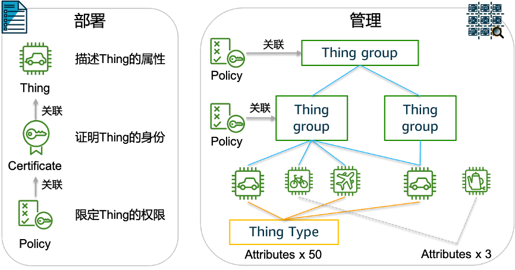
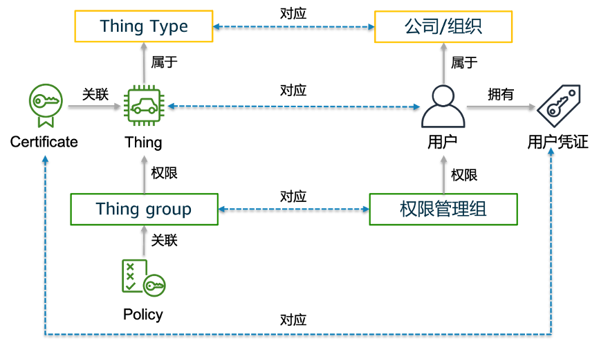
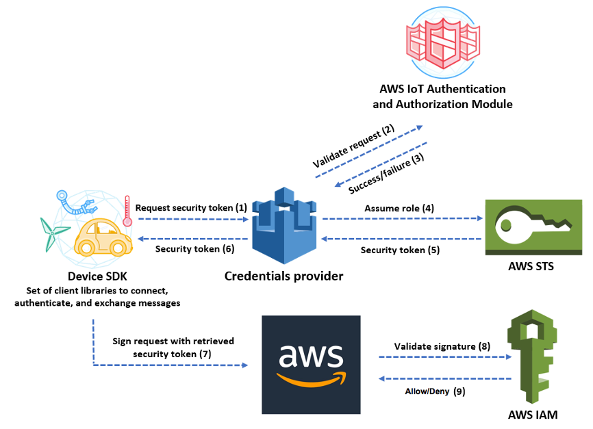

## Authorization-based-on-IoT-Cert
本章节以 [AWS IoT](https://docs.aws.amazon.com/iot/latest/developerguide/what-is-aws-iot.html) 服务为例，介绍如何利用 IoT 证书完成对公有云资源的访问授权基本原理。可以从 [这里](iot-deploy-cn.md) 查看方案的实施步骤。

### 关于 AWS IoT
AWS IoT 通过“物品 (Thing)”、“证书 (Certificate)”、“策略 (Policy)”来管理物联设备。物品可以属于一个或多个物品组 (Thing Group)，策略可以关联给物品、物品组、或物品组中包含的其它物品组。此外，物品还可以属于某一种物品类型 (Thing Type)，属于物品类型的物品可以拥有最多 50 个属性 (Attribute) 用于描述物品，而不属于任何物品类型的物品最多只能拥有 3 个属性。下图所表示的是它们之间的对应关系：

**概念对应关系**

- 用户信息 vs 物品属性：  

通常，在应用系统中进行用户管理时往往需要一个数据库来记录用户信息，例如记录用户的 ID、姓名、电话、邮箱等。AWS IoT 中的物品可以通过属性的方式来记录物品的元数据，这些元数据可以用来表示最终用户的基本信息。

- 用户组 vs 物品组：

用户组通常用来简化对一批同类用户进行授权的过程。在 AWS IoT 服务中，物品组在关联策略之后可以向组内所有物品进行统一授权，这与用户组的概念非常接近。本文中的方法也是用 AWS IoT 物品组代表用户组。

- 公司/组织 vs 物品类型：

每一个物品仅能属于一个物品类型，正如一个用户往往只属于一个公司或组织。在本文中将使用 AWS IoT 物品类型代表现实中的公司。这对于那些多租户的 SaaS 应用非常必要。

整体对应关系如下表示：

**权限设计**
借助关联给物品的证书，AWS IoT 服务与 AWS IAM、AWS STS 等服务集成，可以授权物品直接访问 AWS 资源和服务。这一过程如下图所示：

上图所示过程可以在官方文档上找到 [详细说明](https://docs.aws.amazon.com/iot/latest/developerguide/authorizing-direct-aws.html)。概括而言，这一过程可以细分为两次验证、两次授权：

1. AWS IoT 服务验证证书的有效性，完成认证过程；
2. AWS IoT 对用户进行授权，允许通过 AWS STS 服务继承特定的 IAM 角色，获得临时用户凭证（AKSK）；
3. 用户使用临时用户凭证对 API 调用请求进行签名，AWS 验证签名的有效性；
4. 验证请求有效后，根据对应的 IAM 角色授予相关 AWS 资源的访问权限。

验证有效性的工作由 AWS 服务自动完成，用户只需对上述 2、4 两个环节中涉及到的权限进行设置：

- AWS IoT 权限：授权所使用的证书可以使用 sts:AssumeRole。这是必须授予的权限，是后续操作正常完成的前提。
- AWS IAM Role 权限：授予用户访问具体 AWS 服务的权限。该权限根据不同应用、不同用户进行对应的设置。

在实际应用过程中往往通过“用户组”和/或 传递变量的方式来简化授权过程。如前文中所提到的，我们可以使用 AWS IoT Thing Group 作为“用户组”实现批量授权。在变量方面，AWS IAM 可以接受的 AWS IoT 变量类型如下：

- credentials-iot:ThingName
- credentials-iot:ThingTypeName
- credentials-iot:AwsCertificateId

我们可以利用这些变量实现只使用一个 AWS IAM Role 就可以针对不同用户授予不同权限的目的（例如：每一个用户仅可以访问 Amazon S3 存储桶中自己的目录）。

[【查看方案部署】](iot-deploy-cn.md)

[【返回 README】](../README.md)